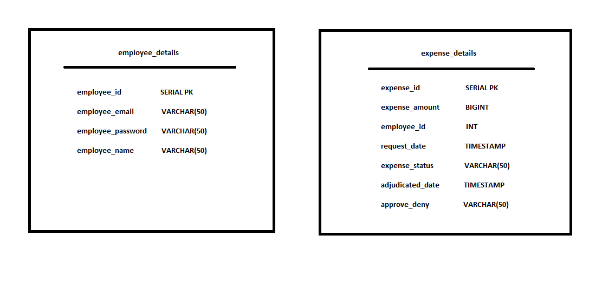

# Revature Project 1
By: Mario Sanchez, Jr. 
    Travis Jackson 
		
Date: 3/11/2022
             
# Angular Expense Reimbursement System

### Description:
      
An Angular delivered reimbursement managements application consisting of:
1. login / logout
2. Manager specific endpoints
3. Associate specific endpoints
4. Managers can approve / deny reimbursement requests
5. Associates can submit reimbursement requests

### Technologies: 

1. Java
2. PostgreSQL for the database
3. JDBC to access the database from Java
4. log4j2 to log program information and errors
5. Javalin to create endpoints for front end to access
6. Angular to deliver a pleasant user experience

### Functionality:

1. Managers can:
	- log in
	- log out
	- edit reimbursement requests
	- approve / deny requests
	- view all requests, pending and resolved
	- view all employees in company

2. Associates can:
	- log in
	- log out
	- submit new reimbursement requests
	- view all their requests
	- view their pending and resolved requests

### Tables Created:

### Assumptions:
1. Associates can only add a new requests, not delete them.
2. Associates can only provide reimbursement amount when submitting.
3. All requests whole numbers. 
4. Associate must know their own employee ID.
5. Managers are the only employees that can edit reimbursement requests.
6. Managers are the only employees that can view complete list of employees and requests.

### Improvements Going Forward:
1. Create a properties file so that the database's login information is not visible in the Java code.
2. Create more tables to better fit a more complex reimbursement management application.
3. Implement more tests using Mockito and JUnit5 as well as unit test for each Angular component.
4. Add a few more user input checks to ensure they cannot enter incorrect information.
5. Provide a more dynamic user experience leveraging the power of Angular to manipulate the DOM.
6. Utilize Github more effectively to better coordinate with partner.

